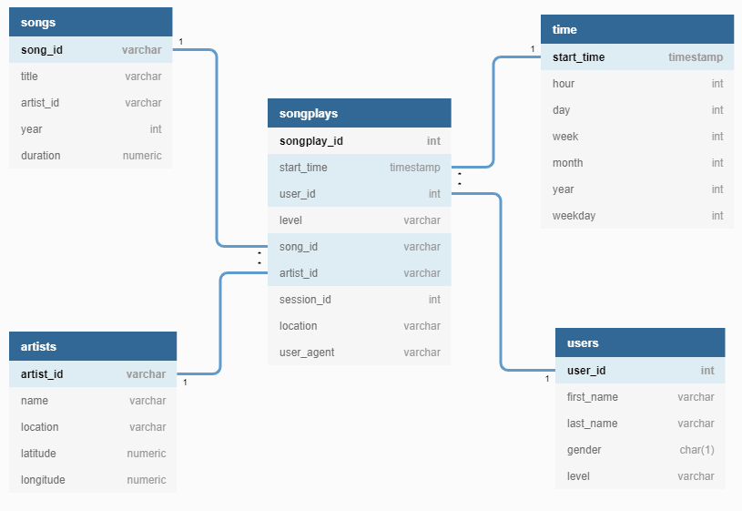

# Data Modelling With Postgres

## Introduction
A startup called Sparkify wants to analyze the data they've been collecting on songs and user activity on their new music streaming app. The analytics team is particularly interested in understanding what songs users are listening to. Currently, they don't have an easy way to query their data, which resides in a directory of JSON logs on user activity on the app, as well as a directory with JSON metadata on the songs in their app.

They'd like a data engineer to create a Postgres database with tables designed to optimize queries on song play analysis, and bring you on the project. Your role is to create a database schema and ETL pipeline for this analysis. You'll be able to test your database and ETL pipeline by running queries given to you by the analytics team from Sparkify and compare your results with their expected results.

## Project Description

In this project, we'll work around data modeling with Postgres and build an ETL pipeline using Python. To complete the project, you will need to define fact and dimension tables for a star schema for a particular analytic focus, and write an ETL pipeline that transfers data from files in two local directories into these tables in Postgres using Python and SQL.
## Database design
#### Schema for Song Play Analysis

Using the song and log datasets, a star schema is created for optimized for queries on song play analysis. This includes the following tables.

#### Fact Table

1.  **songplays**  - records in log data associated with song plays i.e. records with page  `NextSong`
    -   _songplay_id, start_time, user_id, level, song_id, artist_id, session_id, location, user_agent_

#### Dimension Tables

2.  **users**  - users in the app
    * _user_id, first_name, last_name, gender, level_
3.  **songs**  - songs in music database
    -   _song_id, title, artist_id, year, duration_
4.  **artists**  - artists in music database
    -   _artist_id, name, location, latitude, longitude_
5.  **time**  - timestamps of records in  **songplays**  broken down into specific units
    -   _start_time, hour, day, week, month, year, weekday_

**ERD Diagram**:
    
	
## Project Repository files
**Song Dataset**

The first dataset is a subset of real data from the  [Million Song Dataset](https://labrosa.ee.columbia.edu/millionsong/). Each file is in JSON format and contains metadata about a song and the artist of that song. The files are partitioned by the first three letters of each song's track ID. For example, here are filepaths to two files in this dataset.
```
song_data/A/B/C/TRABCEI128F424C983.json
song_data/A/A/B/TRAABJL12903CDCF1A.json
```
And below is an example of what a single song file, TRAABJL12903CDCF1A.json, looks like.

```
{"num_songs": 1, "artist_id": "ARJIE2Y1187B994AB7", "artist_latitude": null, "artist_longitude": null, "artist_location": "", "artist_name": "Line Renaud", "song_id": "SOUPIRU12A6D4FA1E1", "title": "Der Kleine Dompfaff", "duration": 152.92036, "year": 0}
```

**Log Dataset**

The log files in the dataset we will be working with are partitioned by year and month. For example, here are filepaths to two files in this dataset.

```
log_data/2018/11/2018-11-12-events.json
log_data/2018/11/2018-11-13-events.json

```
And below is an example of what the data in a log file, 2018-11-12-events.json, looks like.


## Project Repository files:
1.  `test.ipynb`  displays the first few rows of each table to let test database.
2.  `create_tables.py`  drops and creates your tables. You run this file to reset your tables before each time you run your ETL scripts.
3.  `etl.ipynb`  reads and processes a single file from  `song_data`  and  `log_data`  and loads the data into your tables. This notebook contains detailed instructions on the ETL process for each of the tables. It is mainly used for to test the ETL process.
4.  `etl.py`  reads and processes files from  `song_data`  and  `log_data`  and loads them into your tables.
5.  `sql_queries.py`  contains all sql queries, and is imported into the last three files above.
6.  `README.md`  provides discussion on project.

## ETL Process

1. **Process song_data**: Performed  ETL on the  `song_data` to create the `songs` and `artists` dimensional tables.
2. **Process log_data**: Performed ETL on the second dataset, `log_data`, to create the `time` and `users` dimensional tables, as well as the `songplays` fact table. 


	

	**Extract Data and Songplays Table**

	This one is a little more complicated since information from the songs table, artists table, and original log file are all needed for the  `songplays`  table. Since the log file does not specify an ID for either the song or the artist,  need to get the song ID and artist ID by querying the songs and artists tables to find matches based on song title, artist name, and song duration time.

## How To Run the Project
Below are the commands to run the project code and to create tables according to schema and database design. After that you can perform analytics query on mentioned tables.

At the terminal:

1.  `python create_tables.py`
2.  `python etl.py`

In IPython:

1.  `run create_tables.py`
2.  `run etl.py`
